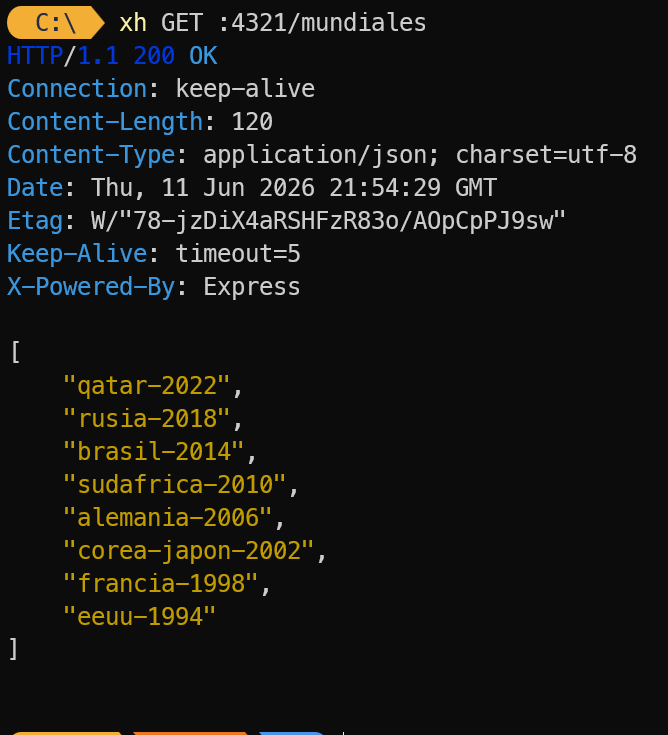
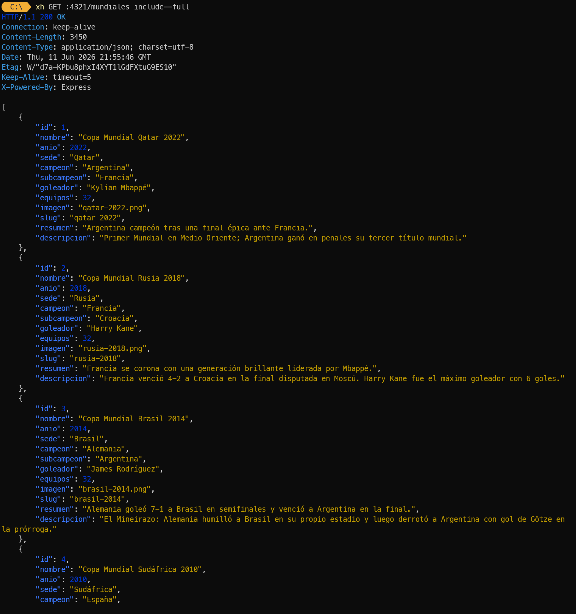
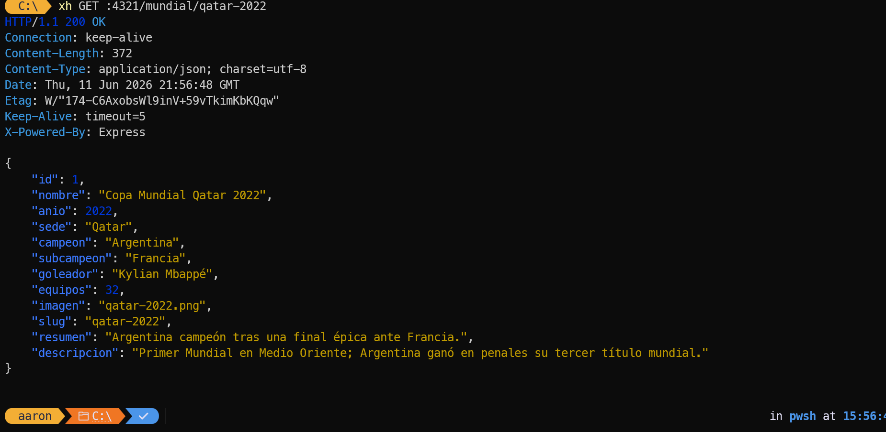
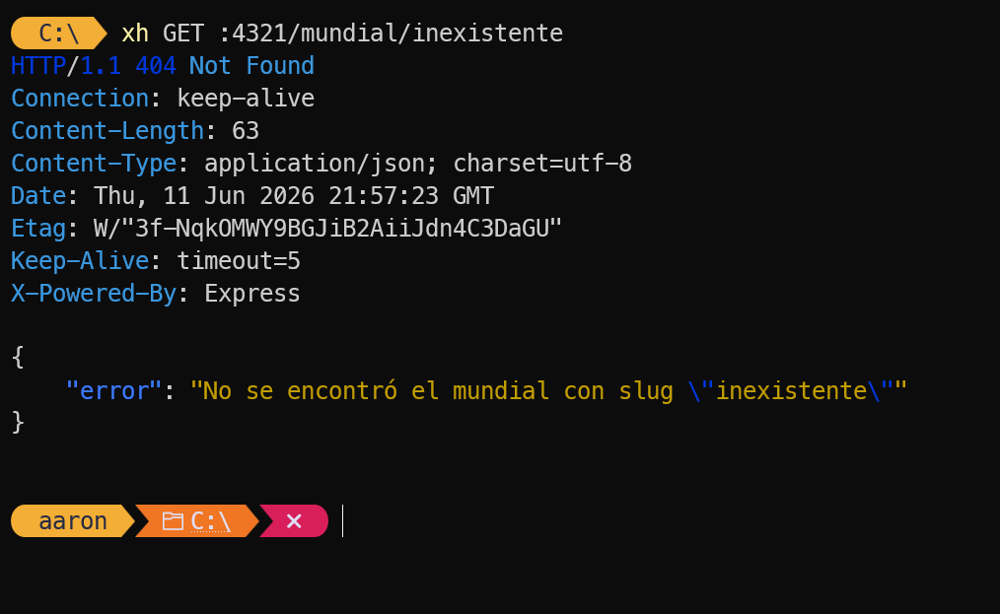
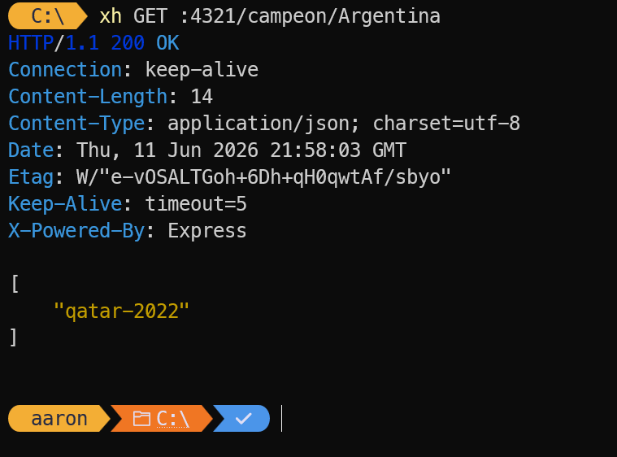
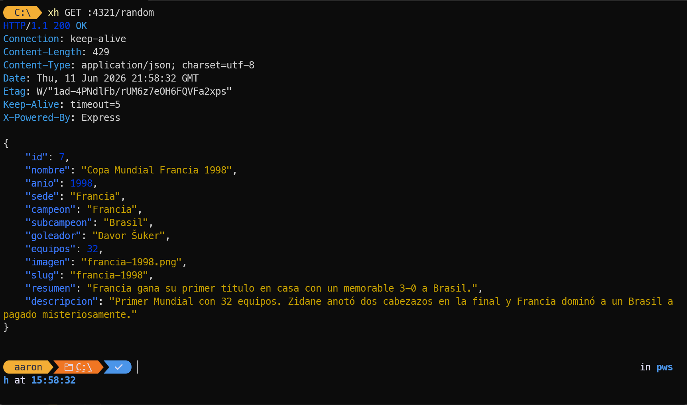
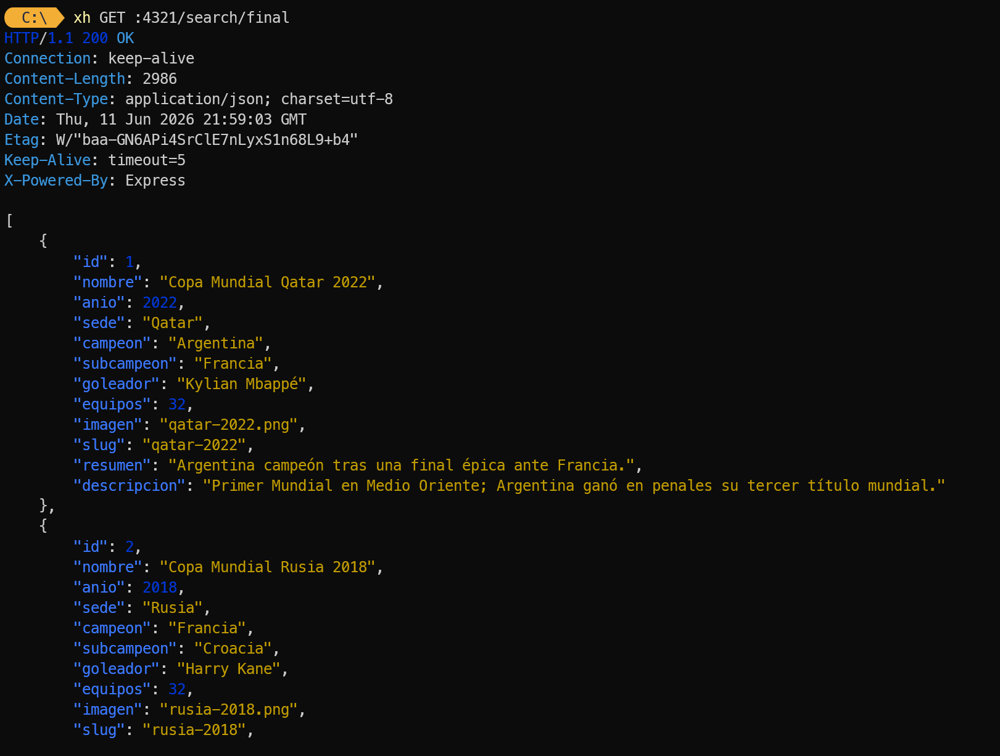
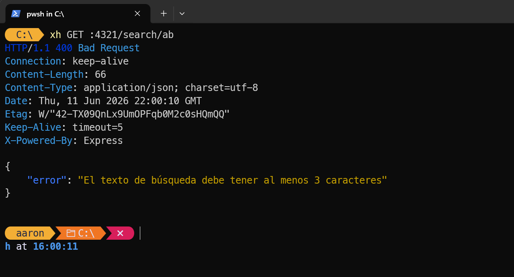

# API Copa Mundial FIFA

API REST construida con Node.js y Express que expone información histórica sobre las ediciones de la Copa Mundial de la FIFA.

## Requisitos

- Node.js 22.5 o superior (usa el módulo `node:sqlite` nativo)
- pnpm

## Instalación

```bash
pnpm install
```

## Poblar la base de datos

Ejecuta el script de seed para crear la base de datos SQLite con los datos de las ediciones:

```bash
pnpm run seed
```

## Ejecutar el servidor

```bash
pnpm run dev
```

El servidor queda disponible en `http://localhost:4321`.

## Rutas disponibles

| Método | Ruta                      | Descripción                                   |
| ------ | ------------------------- | --------------------------------------------- |
| GET    | `/`                       | Información general del API                   |
| GET    | `/mundiales`              | Lista todas las ediciones (slugs por defecto) |
| GET    | `/mundiales?include=full` | Lista completa con todos los campos           |
| GET    | `/mundial/:slug`          | Detalle de una edición por su slug            |
| GET    | `/campeon/:pais`          | Slugs de ediciones ganadas por ese país       |
| GET    | `/random`                 | Una edición aleatoria                         |
| GET    | `/search/:text`           | Búsqueda por texto (mínimo 3 caracteres)      |
| GET    | `/imagenes/*`             | Archivos de imagen de las ediciones           |

## Evidencia de pruebas con xh

Comandos ejecutados con [xh](https://github.com/ducaale/xh) contra el servidor en `http://localhost:4321`.

---

### 1. `GET /mundiales` — Lista de slugs

```bash
xh GET :4321/mundiales
```



---

### 2. `GET /mundiales include==full` — Lista completa

```bash
xh GET :4321/mundiales include==full
```



---

### 3. `GET /mundial/qatar-2022` — Detalle por slug `200 OK`

```bash
xh GET :4321/mundial/qatar-2022
```



---

### 4. `GET /mundial/inexistente` — Slug no existe `404 JSON`

```bash
xh GET :4321/mundial/inexistente
```



---

### 5. `GET /campeon/Argentina` — Ediciones por campeón

```bash
xh GET :4321/campeon/Argentina
```



---

### 6. `GET /random` — Edición aleatoria

```bash
xh GET :4321/random
```



---

### 7. `GET /search/final` — Búsqueda válida `200 OK`

```bash
xh GET :4321/search/final
```



---

### 8. `GET /search/ab` — Búsqueda inválida `400 Bad Request` (mínimo 3 caracteres)

```bash
xh GET :4321/search/ab
```


